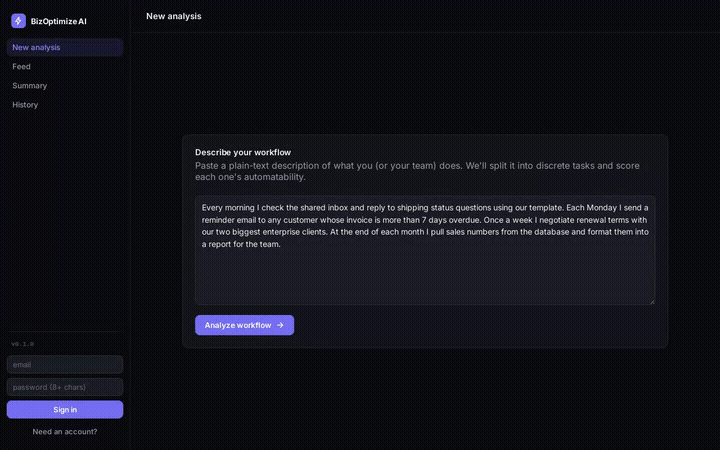

# BizOptimize AI

Paste a plain-text description of a business workflow. BizOptimize AI splits it into
discrete tasks, scores each task's automatability (0-100) with a Random Forest
classifier trained on linguistic/structural features, retrieves relevant automation
scripts for anything scoring 70+ via RAG over a vector DB, lets you swipe through
those candidates Tinder-style to build a personal automation plan, and can generate a
tailored code snippet for anything you pick using a LangChain retrieval-augmented-generation
chain.

**Live demo:** https://bizoptimize-frontend.onrender.com
_(free-tier hosting — the backend/gateway/ML service spin down after ~15 min idle and
take up to 50s to wake on the first request)_



## Highlights

- **Full-stack polyglot system, deployed live**: React, Flask, Spring Boot (Java 17),
  and Python across 4 independently-deployable services plus a managed Postgres
  instance, all on Render's free tier via a single Infrastructure-as-Code blueprint
  (`render.yaml`).
- **Defensible ML methodology, not "ask an LLM to score it"**: automatability scoring
  comes from a `RandomForestRegressor` trained on a hand-labeled seed dataset, with
  every prediction explained via the model's actual feature importances — the LLM
  (Gemini) is only ever used for parsing free text into tasks, never for scoring.
- **Two deliberately distinct RAG implementations**: a raw `chromadb` query for
  score-time retrieval, and a separate LangChain LCEL chain
  (`retriever | prompt | llm | parser`) for on-demand code generation — chosen
  per-feature based on whether the problem is actually retrieval-augmented
  *generation*, not framework-for-framework's-sake.
- **Diagnosed and fixed a real production incident**: the ML service OOM-crashed on
  Render's 512MB free tier after initial deploy; root-caused it to a local
  PyTorch/sentence-transformers embedding model, and migrated both retrieval paths to
  Gemini's hosted embeddings API to remove the dependency entirely.
- **Tested across every service**: 17 ml-service tests (retry/backoff, scoring,
  RAG, feature extraction), 10 gateway tests, backend integration tests (Spring
  `@SpringBootTest` + `MockMvc` + H2), and frontend unit tests (Vitest + Testing
  Library, including a swipe-deck bug caught and fixed via the test suite) — plus a
  4-job GitHub Actions CI pipeline running all of it.

## Architecture

```
React (frontend)
   |
   v
Flask (gateway) --------> Spring Boot / Java (core backend)
   |                                |
   v                                v
Python ML service              Postgres (users, workflows, tasks)
(NLP feature extraction,
 Random Forest scoring,
 Gemini embeddings, Chroma RAG)
```

- **`/frontend`** -- React (Vite) dashboard: workflow input, a Tinder-style swipe deck
  for deciding what to automate, a savings summary, per-task automation instructions
  with on-demand code generation, and saved workflow history with persisted decisions.
- **`/gateway`** -- Flask. The single entry point for the frontend. Routes to the
  ML service or the Java backend, and orchestrates calls that need both.
- **`/backend`** -- Spring Boot. Auth (JWT), Postgres persistence for
  users/workflows/tasks (including which ones were swiped to automate vs. skip), and
  the savings/ROI calculation.
- **`/ml-service`** -- Python/Flask. Gemini-based workflow parsing, spaCy feature
  extraction, a scikit-learn Random Forest for scoring, a Chroma vector store for RAG
  retrieval of automation scripts, and a separate LangChain chain for generating a
  tailored code snippet per task on demand.

## Why this split

Only the ML service calls an LLM (Google's Gemini API, chosen for its free tier),
and only for the part LLMs are actually good at: turning messy free text into
discrete task strings, plus a short natural-language hint per task.
**The automatability score itself comes from the Random Forest, not the LLM**
-- see [Scoring methodology](#scoring-methodology) for why that distinction matters.

## Running locally

Requirements: Docker and Docker Compose.

```bash
cp .env.example .env
# edit .env and set GEMINI_API_KEY to your own free key (https://aistudio.google.com/apikey)
docker compose up --build
```

- Frontend: http://localhost:3000
- Gateway: http://localhost:5000
- ML service: http://localhost:5001
- Backend: http://localhost:8080
- Postgres: localhost:5432

The first `/analyze` request after a fresh start populates the Chroma vector stores
via Gemini's embeddings API (~27 corpus entries) -- a few seconds one-time cost, since
embedding needs the API key and can't happen at Docker build time.

## Scoring methodology

The score is **not** "ask an LLM to rate this 0-100." That's a common shortcut that
doesn't hold up under interview scrutiny, since it isn't reproducible and can't be
explained. Instead:

1. **Feature extraction** (`ml-service/app/nlp/feature_extractor.py`): spaCy lemmatizes
   each task description, and we count lemma matches against curated keyword banks --
   repetitiveness/frequency language, rule-based/conditional markers, data-structure and
   tool/system mentions, human-judgment language, and an explicit stated-frequency regex
   (e.g. "3 times a week"). Counts are normalized by task length.
2. **Random Forest** (`ml-service/models/train_model.py`): a `RandomForestRegressor`
   (scikit-learn) trained on those 7 numeric features to predict a 0-100 score. We use a
   regressor rather than a discrete classifier because the target is a continuous score;
   the 70+ threshold is applied afterward as a decision boundary for RAG retrieval.
3. **Explainability** (`ml-service/app/scoring/classifier.py`): each prediction comes with
   a plain-English blurb built from the model's `feature_importances_` combined with that
   specific task's feature values -- so it names the actual signals that drove *this*
   score, not a canned sentence.
4. **Gemini API** (`ml-service/app/nlp/workflow_parser.py`) is used only to parse raw workflow
   text into discrete task strings and generate a one-line hint per task. It never sees or
   sets the automatability score. Gemini was chosen over Claude/OpenAI here specifically for
   its free tier -- fine for a student project's usage volume.

### Honest data disclosure

There is no labeled real-world dataset for "how automatable is this task." The Random
Forest is bootstrapped on a **hand-labeled seed dataset of ~70 example tasks**
(`ml-service/data/seed_dataset.csv`) spanning common business functions -- data entry,
customer communication, scheduling, invoicing, reporting, approvals, HR, sales/marketing,
and IT ops. Scores were assigned by us using a simple rubric: high repetitiveness + rule-based
logic + existing tool/API integration pushes a task toward 100; negotiation, judgment,
mentoring, and strategy push it toward 0. `train_model.py` reports the model's R² and MAE
on a held-out 20% split of this seed set -- treat that as a sanity check on a small dataset,
**not** a claim of production accuracy. Retraining on real usage data collected through the
app itself (once there's enough of it) is the natural next step, not yet done here.

## RAG methodology

- **Vector DB:** Chroma, running embedded (`ml-service/app/rag/vector_store.py`) -- no
  separate server to deploy or manage.
- **Embeddings:** Gemini's hosted embeddings API (`models/gemini-embedding-001`), called
  through the same `google-genai` SDK used for workflow parsing. Originally used a local
  `sentence-transformers` model, but that pulls in PyTorch and pushed the ML service's
  container past Render's free-tier 512MB memory limit in production -- see the
  [Highlights](#highlights) section above for how that got diagnosed and fixed.
- **Corpus:** `ml-service/data/automation_corpus/corpus.json` -- 27 hand-written automation
  script/instruction entries covering the same business-function categories as the seed
  dataset, each tagged with a category and relevant tool/library tags.
- **Retrieval:** cosine similarity search (Chroma's default) over the task description,
  top-3 results, surfaced only for tasks scoring 70+.

## Code generation (LangChain)

The RAG retrieval above returns a matched *instructional write-up* verbatim (e.g. "use a
cron job + pandas + openpyxl for this"). That's retrieval, not generation, so it's built
as a single raw `chromadb` query in `ml-service/app/rag/vector_store.py` -- a framework
would only add indirection for one query.

The **"Generate code"** action (available per task in the Feed's post-swipe summary) is a
genuine two-step retrieval-augmented-generation chain: retrieve the closest reference
pattern(s), then splice them into a prompt alongside this task's exact wording and have
Gemini generate a new, tailored snippet. That's the kind of pipeline LangChain is actually
built for, so `ml-service/app/rag/code_chain.py` builds it with LangChain's LCEL syntax:

```python
chain = (
    RunnableParallel(context=retriever | format_docs, task=passthrough)
    | prompt
    | llm
    | StrOutputParser()
)
```

- **Retriever:** a separate LangChain-managed `Chroma` vector store (`langchain-chroma`),
  populated from the same automation corpus, embedded with `langchain-google-genai`'s
  `GoogleGenerativeAIEmbeddings` wrapper around Gemini's embeddings API.
- **Generation:** `langchain-google-genai`'s `ChatGoogleGenerativeAI`, pointed at the same
  Gemini model used elsewhere.
- **Why a separate module from `vector_store.py`:** the existing scoring-time retrieval
  and this generation chain solve different problems. Reaching for LangChain everywhere,
  including the simple single-call paths (workflow parsing, score-time retrieval), would
  add framework overhead with no real benefit there -- it's used specifically where the
  retrieve-then-generate pattern actually applies.

## Persisted swipe decisions

Automate/skip decisions made in the Feed aren't just session-local UI state -- they're
saved to Postgres per task (`automation_decision` column) and restored when a saved
workflow is reopened from History. Re-entering the Feed for an already-decided workflow
skips straight to the summary instead of asking you to re-swipe tasks you've already
made a call on.

## Savings / ROI calculation

For each task, once you enter hours/week and an hourly rate:

```
estimated annual savings = hours_per_week × 52 × hourly_rate × (score / 100)
```

The `score / 100` factor is a deliberate simplification: a task scored 85/100 is assumed
to have ~85% of its time reclaimable once automated, not 100% -- some human oversight or
exception-handling typically remains. This is a heuristic, not a measured result, and is
labeled as an *estimate* in the UI.

## Testing

```bash
# ML service (17 tests: scoring, feature extraction, RAG, retry/backoff)
cd ml-service && pip install -r requirements.txt && python models/train_model.py && pytest

# Gateway (10 tests: proxying, error handling, orchestration)
cd gateway && pip install -r requirements.txt && pytest

# Backend (Spring Boot integration tests via H2 in-memory DB)
cd backend && ./mvnw test    # or `mvn test` if you have Maven installed locally

# Frontend (Vitest + React Testing Library)
cd frontend && npm install && npx vitest run
```

All four run automatically on every push via `.github/workflows/ci.yml`.

## Deployment

Deployed on [Render](https://render.com) as a single Blueprint (`render.yaml`) --
one `git push` provisions everything:

- **Frontend** -- static site (Vite build, no server needed).
- **Gateway + Backend + ML service** -- Docker web services, each built from its own
  Dockerfile.
- **Postgres** -- Render's managed free-tier database.

Each service reads its config from environment variables and has its own Dockerfile, so
any piece can also be deployed independently, or run entirely locally via
`docker compose up`.

## Environment variables

See `.env.example`. At minimum you need `GEMINI_API_KEY` (your own free key from
https://aistudio.google.com/apikey) for workflow parsing, scoring-time retrieval, and
code generation. Never commit a real key.

## Tech stack

React · Flask · Spring Boot (Java 17) · Postgres · scikit-learn · spaCy · Chroma ·
LangChain · Gemini API (Google, chat + embeddings) · Docker Compose · Render ·
GitHub Actions
